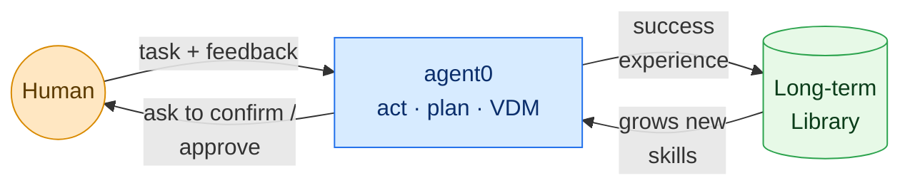
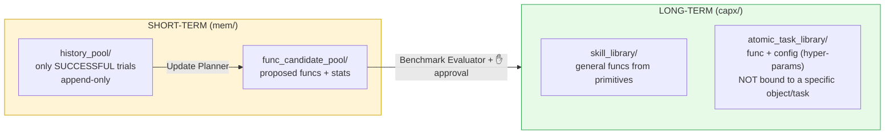
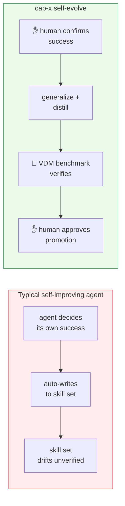

# Self-Evolve Framework — Visual Overview

> Visualization of the cap-x self-evolve agent design and its novelty.
> Companion to [README.md](README.md). Diagrams are Mermaid — render in any
> Mermaid-aware viewer (GitHub, VS Code Markdown Preview Mermaid Support, etc.).

---

## 1. The Big Picture

cap-x **agent0** can already act in the environment, plan, and self-evaluate
task progress via **VDM**. The self-evolve system adds a **closed loop** on top:
turn *human-confirmed* successful interactions into **verified, human-approved,
lifelong** capabilities — without letting unverified code silently leak into the
long-term skill set.



---

## 2. End-to-End Pipeline

Two memory tiers, two human gates (✋), one automatic verifier (🤖 VDM).

```mermaid
flowchart TD
    subgraph LIVE["① Live Loop — human-in-the-loop"]
        direction TB
        L1[Model self-driven multi-turn<br/>generate → execute → visual diff → REGENERATE/FINISH]
        L2{{"✋ Human judges: Finish = success<br/>(the ONLY success signal)"}}
        L1 --> L2
        L2 -. "feedback → reset & rerun whole round" .-> L1
    end

    subgraph SHORT["Short-term memory build-up"]
        direction TB
        FP["② Feedback Postprocessor<br/>multi-round rewrite → generalize /<br/>turn one-shot feedback into hyper-params<br/>✋ human judges right/wrong each round only"]
        ED["③ Experience Distill<br/>debugger-style, length-bounded,<br/>sourced digest with [#idx] back-refs"]
        FP --> ED
    end

    HP[("history_pool/<br/>&lt;id&gt;.json  (full, drill-down)<br/>&lt;id&gt;.digest.md  (read by default)")]:::mem

    subgraph PLAN["④ Update Planner — Library Mgmt (front half)"]
        direction TB
        P1["LLM-1 propose<br/>digest-first, drill-on-demand"]
        P2["LLM-2 review<br/>dedup · bug · general · atomic granularity"]
        P1 --> P2
        P2 -. "revise (≤ max_revise)" .-> P1
    end

    CP[("func_candidate_pool/<br/>&lt;func&gt;.py + &lt;func&gt;.stats.json<br/>(cumulative stats)")]:::mem

    subgraph EVAL["⑤ Benchmark Evaluator — Library Mgmt (back half)"]
        direction TB
        E1["inject candidates as OPTIONAL tools<br/>run benchmark in sim · 🤖 VDM auto-judge"]
        E2["accumulate stats<br/>(positive / used_runs / eval_runs)"]
        E3["generate report → propose<br/>promote / abandon / keep"]
        E1 --> E2 --> E3
    end

    GATE{{"✋ USER APPROVAL REQUIRED<br/>no long-term update/delete without it"}}:::gate

    LT[("Long-term library<br/>capx/skill_library/<br/>capx/atomic_task_library/")]:::longmem

    CRON["⑥ Heartbeat / Cron<br/>daily tasks + nightly trigger"]:::cron

    LIVE -->|"success trial<br/>(used extra feedback info)"| SHORT
    SHORT -->|final_code + digest| HP
    HP -->|"trigger: ≥ trigger_history_count unprocessed (def. 5)"| PLAN
    PLAN -->|LLM-2 writes candidate| CP
    CP -->|"nightly cron (or manual), pool non-empty"| EVAL
    EVAL --> GATE
    GATE -->|approved| LT
    LT -.->|grows tools agent0 can call| LIVE
    CRON -.->|schedules| EVAL

    classDef mem fill:#fff5d6,stroke:#caa000,color:#4a3a00;
    classDef longmem fill:#e7f9e7,stroke:#2da44e,color:#0b3d1a;
    classDef gate fill:#ffd9d9,stroke:#cf222e,color:#5c0a12;
    classDef cron fill:#ece7ff,stroke:#7c3aed,color:#2e1065;
```



**Trigger cadence:** Update Planner fires often (every ≥5 unprocessed histories);
Benchmark Evaluator fires rarely (nightly cron / manual). Short-term memory
accumulates fast; long-term consolidation is deliberate and gated.

---

## 3. Memory Tiers & Data Contract



`history_pool` is consumed **only** by Library Management. A `.digest.md` is the
default read view (small, length-bounded, every claim tagged `[#idx]`); the full
`.json` `chat_history` is the source of truth, reached by **drill-down** only when
a claim needs verifying — keeping the planner's context from exploding.

---

## 4. What's Novel

```mermaid
mindmap
  root((cap-x<br/>self-evolve))
    Human is the only success signal
      VDM never ends the live loop
      model FINISH never auto-succeeds
      hard errors can never be "success"
    Two human gates, not one
      per-round right/wrong in Postprocessor
      mandatory approval before ANY long-term update/delete
    Generalize-by-rewrite
      one-shot human feedback becomes hyper-param
      e.g. hardcoded z-offset becomes grasp config
      verified by re-execution in env
    Experience observability
      big trace → small sourced digest
      [#idx] back-refs to full chat_history
      digest-first, drill-on-demand
      context cost paid ONCE at write time
    Atomic task library
      func + config, reusable workflow
      not tied to a specific object/task
      generic pick is OK · object-bound put_apple rejected
    No-negative bookkeeping
      promote by positive threshold only
      abandon only if idle AND unreferenced
      tried-then-dropped ≠ bad
    Self-verifiable & lifelong
      VDM auto-eval in benchmark sim
      heartbeat/cron drives evolution
```

### The core contrast



The thesis: **capability growth is closed-loop and trustworthy** — every new
long-term skill is human-confirmed at intake, generalized, automatically
benchmark-verified, and human-approved before it can ever be invoked again.

---

## 5. Hard Constraints (must hold in any implementation)

| Constraint | Where |
| --- | --- |
| Success signal **only** from human; VDM only in Benchmark Evaluator | [01-interactive-loop.md](01-interactive-loop.md) |
| Any long-term update/delete needs **user approval** | [05-benchmark-evaluator.md](05-benchmark-evaluator.md) |
| No negative bookkeeping; abandon only when idle **and** unreferenced | [05-benchmark-evaluator.md](05-benchmark-evaluator.md) |
| Use term **"atomic task library"**; not object/task-bound | [concepts.md](concepts.md) |
| Promote into `capx/skill_library/` & `capx/atomic_task_library/`; pools live in `mem/` | [storage.md](storage.md) |
